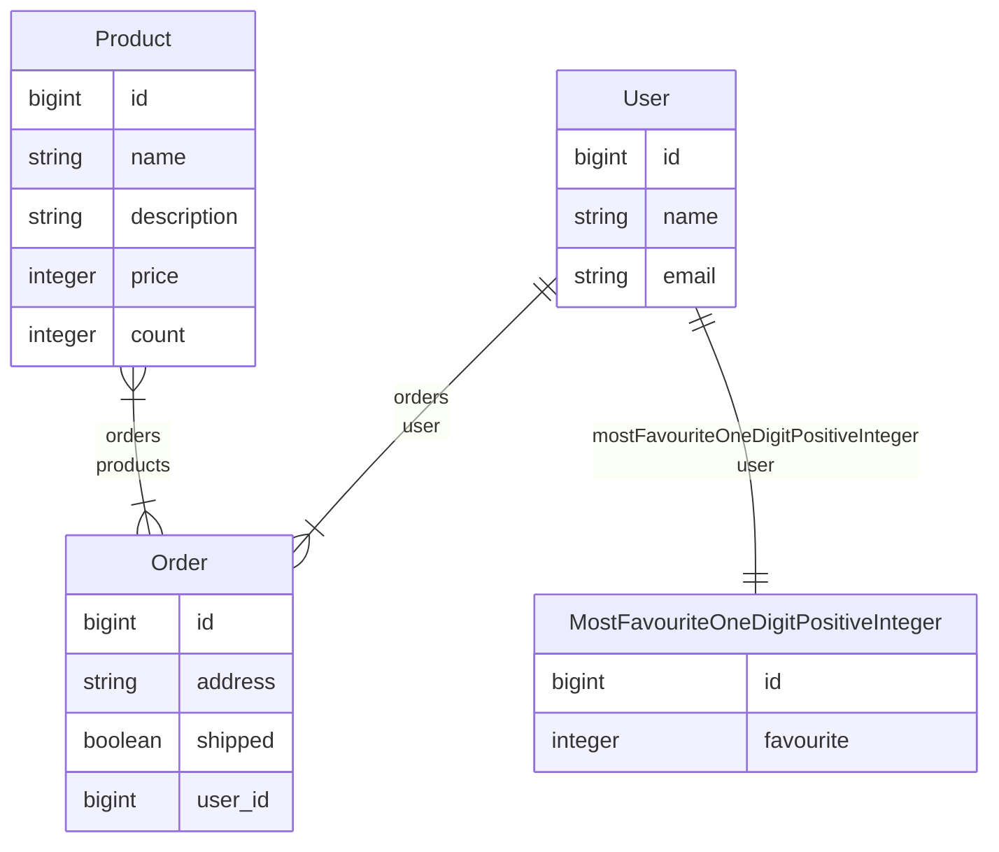

# GraphQL - Lighthouse cheat sheet

## Tartalomjegyzék

- [I. Telepítés és beállítások](#i-telepítés-és-beállítások)
    - [1. A Lighthouse csomag telepítése Composer segítségével](#1-a-lighthouse-csomag-telepítése-composer-segítségével)
    - [2. Az alapértelmezett *schema* publikálása](#2-az-alapértelmezett-schema-publikálása)
    - [3. GraphiQL eszköz telepítése](#3-graphiql-eszköz-telepítése)
    - [4. Konfigurációs fájl publikálása (opcionális)](#4-konfigurációs-fájl-publikálása-opcionális)
- [II. Authentikáció](#ii-authentikáció)
- [III. Validáció](#iii-validáció)
- [IV. Példa modellek](#iv-példa-modellek)
- [V. Schema](#v-schema)
    - [1. Type](#1-type)
    - [2. Relációk](#2-relációk)
        - [1 - 1](#1---1)
        - [1 - N](#1---n)
        - [N - M](#n---m)
    - [3. Lekérdezések](#3-lekérdezések)
    - [4. Aggregációk](#4-aggregációk)
- [VI. Mutation schema](#vi-mutation-schema)
    - [1. CREATE](#1-create)
    - [2. UPDATE](#2-update)
    - [3. DELETE](#3-delete)
- [VII. Összetettebb Query és Mutation schema készítése](#vii-összetettebb-query-és-mutation-schema-készítése)

## I. Telepítés és beállítások

A GraphQL könnyen hozzáadható a Laravel projektünkhöz, a részletes lépések megtalálhatók [itt](https://lighthouse-php.com/master/getting-started/installation.html "Lighthouse installation").

### 1. A Lighthouse csomag telepítése Composer segítségével

```console
composer require nuwave/lighthouse
```

### 2. Az alapértelmezett *schema* publikálása

```console
php artisan vendor:publish --tag=lighthouse-schema
```

### 3. GraphiQL eszköz telepítése

```console
composer require mll-lab/laravel-graphiql
```

### 4. Konfigurációs fájl publikálása (opcionális)

```console
php artisan vendor:publish --tag=lighthouse-config
```

## II. Authentikáció

A különböző *field*-ek a [```@guard```](https://lighthouse-php.com/master/api-reference/directives.html#guard) direktíva segítségével védhetőek le, ennek helyes működéséhez publikálni kell a konfigurációs fájlt (lásd fentebb).

A megfelelő *auth guard*-ot be kell állítani.

```php
// config/lighthouse.php

return [
    // ...
    "guards" => ["sanctum"], // sanctum = Laravel Sanctum (stateless konfigurációs) használata
    // ...
];
```

> [!NOTE]
> Amennyiben stateful authentikációt szeretnénk használni ezt az [útmutatót](https://lighthouse-php.com/master/security/authentication.html#get-the-current-user) érdemes követni.

## III. Validáció

A bemenetek validációjához a [```@rules(apply: [...])```](https://lighthouse-php.com/master/api-reference/directives.html#rules) direktíva használható. Az ```apply``` array-ben a Laravel beépített [validációs szabályai](https://laravel.com/docs/11.x/validation#available-validation-rules "Laravel Validation") használhatók a megszokott módon.

> [!NOTE]
> A [```@rules```](https://lighthouse-php.com/master/api-reference/directives.html#rules) direktíván belül van lehetőségünk felülírni azattribútumok neveit és a hibaüzeneteket. Az előbbire használható a ```attribute``` attribútum, míg az utóbbira a ```messages``` array.


**Példa Query esetén**
```graphql
type Query {
    user(
        # Az email attribútumnak email formátumúnak kell lennie és léteznie kell hozzá tartozó rekordnak a users tábla email mezőjén
        email: String @rules(apply: ["email", "exists:users,email"], attribute: "email cím", messages: [{ rule: "email", message: "A megadott email cím hibás formátumú!" }])
    )
}
```

**Példa Mutation esetén**

```graphql
type Mutation {
    createUser(input: CreateUserInput! @spread): User! @create
}

input CreateUserInput {
    name: String! @rules(
        apply: ["max:100"],
        attribute: "A név",
        messages: [{
            rule: "max",
            message: ":attribute mező túl hosszú!"
        }]
    )
    email: String! @rules(
        apply: ["email", "unique:users,email"],
        attribute: "Az email",
        messages: [
            {
                rule: "email",
                message: ":attribute mező formája hibás!"
            },
            {
                rule: "unique",
                message: ":attribute már foglalt!"
            }
        ]
    )
    mostFavouriteOneDigitPositiveInteger: Int @rules(
        apply: ["min:0", "max:9"],
        attribute: "A kedvenc egy jegyű pozitív egész szám",
        messages: [
            {
                rule: "min",
                message: ":attribute mező értéke nem lehet kisebb nullánál!"
            },
            {
                rule: "max",
                message: ":attribute mező értéke nem lehet nagyobb kilencnél!"
            }
        ]
    )
}
```

> [!NOTE]
> Láthatjuk, hogy ha sok szabályunk van, akkor hosszú és átláthatatlan spagettit kaphatunk, ennek elkerülése érdekében [ki tudjuk szervezni az adott *field* validációját egy külön osztályba](https://lighthouse-php.com/master/security/validation.html#validator-classes "Validator Classes"). Ekkor a [```@validator```](https://lighthouse-php.com/master/api-reference/directives.html#validator) direktívát kell használni.

## IV. Példa modellek

Az alábbi példákban az alább látható diagram szerinti modellek szerepelnek a jobb érthetőség érdekében.



## V. Schema

### 1. Type

A modelleket egy-egy type-ként tudjuk definiálni. A GraphQL-ben elérhető alapvető típusok elég korlátozottak:
  - ID (string, elsősorban nem a felhasználók számára adják meg)
  - Int
  - Float
  - String
  - Boolean

Ha egy mező nem lehet null, akkor azt a típus után egy felkiáltójellel jelezzük (pl.: String!)

Lehetőség van az fenti primitív adattípusoktól eltérő, összetett típusokat használni, ehhez importálni kell a [```@scalar```](https://lighthouse-php.com/master/api-reference/directives.html#scalar) direktíva segítségével a megfelelőt. [További információ és egyedi Scalar készítése](https://lighthouse-php.com/master/the-basics/types.html#scalar)

Ha valahol egy bizonyos típusba tartozó elemek tömbjét szeretnénk definiálni, akkor a típust szögletes zárójelekbe tesszük. pl.: ```[Int]```

```graphql
scalar DateTime @scalar(class: "Nuwave\\Lighthouse\\Schema\\Types\\Scalars\\DateTime")

type User {
    id: ID!
    name: String!
    email: String!
    created_at: DateTime!
    updated_at: DateTime!
}
```

### 2. Relációk

#### 1 - 1

```graphql
type User {
    # ...

    mostFavouriteOneDigitPositiveInteger: Int @hasOne
}

type MostFavouriteOneDigitPositiveInteger {
    # ...

    user: User! @belongsTo
}
```

#### 1 - N

```graphql
type User {
    # ...

    orders: [Order!]! @hasMany
}

type Order {
    # ...

    user: User! @belongsTo
}
```

#### N - M

```graphql
type Order {
    # ...

    products: [Product!]! @belongsToMany
}

type Product {
    # ...

    orders: [Order!]! @belongsToMany
}
```

### 3. Lekérdezések

```graphql
type Query {
    # Összes elem lekérdezése
    products: [Product!]! @all
    productLikeName(name: String! @where(operator: "like")): [Product!]! @all

    # Elem lekérdezése id alapján
    productByID(id: Int! @eq): Product @find

    # Sorba rendezés
    latestOrders: [Order!]! @all @orderBy(column: "created_at", direction: DESC)
    # Sorba rendezés kliens oldalról irányítva
    orders(orderBy: _ @orderBy(columns: ["created_at", "address"])): [Order!]! @all

}
```

Használható direktívák:
  - [```@all```](https://lighthouse-php.com/master/api-reference/directives.html#all): Összes lekérdezése
  - [```@find```](https://lighthouse-php.com/master/api-reference/directives.html#find): A megadott argumentumokon keres
  - [```@first```](https://lighthouse-php.com/master/api-reference/directives.html#first): A collection első elemének lekérdezése
  - [```@eq```](https://lighthouse-php.com/master/api-reference/directives.html#eq): Egyenlő
  - [```@in```](https://lighthouse-php.com/master/api-reference/directives.html#in): A megadott tömbben van
  - [```@like```](https://lighthouse-php.com/master/api-reference/directives.html#like): LIKE típusú lekérdezés
  - [```@limit```](https://lighthouse-php.com/master/api-reference/directives.html#limit): A maximális visszatérési érték számának megadása
  - [```@neq```](https://lighthouse-php.com/master/api-reference/directives.html#neq): Nem egyenlő
  - [```@notIn```](https://lighthouse-php.com/master/api-reference/directives.html#notIn): A megadott tömbben nincs benne
  - [```@orderBy```](https://lighthouse-php.com/master/api-reference/directives.html#orderBy): Rendezés
  - [```@paginate```](https://lighthouse-php.com/master/api-reference/directives.html#paginate): Lapozhatóság
  - [```@where```](https://lighthouse-php.com/master/api-reference/directives.html#where): WHERE típusú lekérdezés
  - [```@whereBetween```](https://lighthouse-php.com/master/api-reference/directives.html#whereBetween): Két érték között keres
  - [```@whereKey```](https://lighthouse-php.com/master/api-reference/directives.html#whereKey): Az elsődleges kulcsra szűr
  - [```@whereNotBetween```](https://lighthouse-php.com/master/api-reference/directives.html#whereNotBetween): Két értéken kívüli intervallumon keres
  - [```@whereNotNull```](https://lighthouse-php.com/master/api-reference/directives.html#whereNotNull): Nem null
  - [```@whereNull```](https://lighthouse-php.com/master/api-reference/directives.html#whereNull): Null


### 4. Aggregációk

Aggregációs lekérdezéseknél használhatók az alábbi direktívák.

[**@count**](https://lighthouse-php.com/master/api-reference/directives.html#count)

```graphql
type Query {
    # Egy modell példányainak száma
    productCount: Int! @count(model: "Product")
}

type User {
    # ...

    # Reláción keresztüli elemszám lekérdezése
    orderCount: Int! @count(relation: "orders")
}
```

[**@aggregate**](https://lighthouse-php.com/master/api-reference/directives.html#aggregate)

Aggregációs függvények használataához van szükségünk erre a direktívára.

```graphql
type Query {
    productsMinPrice: Int! @aggregate(model: "Product", column: "price", function: MIN)
    
    productsMaxPrice: Int! @aggregate(model: "Product", column: "price", function: MAX)

    productsAvgPrice: Float! @aggregate(model: "Product", column: "price", function: AVG)
}
```

## VI. Mutation schema

> [!WARNING]
> Mindenhol figyelni kell a névkonvenciókra! Amennyiben ezt nem tesszük meg, a direktívákban lévő field-ek segítségével további konfigurációkat kell tennünk. Ezek részleteit lásd [itt](https://lighthouse-php.com/master/api-reference/directives.html).

### 1. CREATE

```graphql
type Mutation {
    createProduct(input: ProductInput! @spread): Product! @create
}

input ProductInput {
    name: String!
    description: String!
    price: Int!
    count: Int!
}
```

### 2. UPDATE

```graphql
type Mutation {
    updateProduct(id: Int!, input: ProductInput @spread): Product! @update
}

input ProductInput {
    name: String
    description: String
    price: Int
    count: Int
}
```

### 3. DELETE

```graphql
type Mutation {
    deleteProduct(id: Int! @whereKey): Product @delete
}
```


## VII. Összetettebb Query és Mutation schema készítése

Amennyiben egyedi algoritmust kell írni vagy túl bonyolult lenne *schema dirketívákkal* definiálni egy *field*-et, készíthetünk *resolver*-t. A *schema*-ba el kell készíteni a *Query* vagy *Mutation* *field*-et, a szokásos módon. A visszatérési érték után azonban itt nem használunk semmilyen direktívát.

Az alábbi *artisan* parancsok egyikével tudunk generálni *resolver*-t.

```console
php artisan lighthouse:query CustomResolver

php artisan lighthouse:mutation CustomResolver
```

> [!WARNING]
> A helyes működés érdekében figyelni kell a névkonvenciókra!
> pl.:
>      statistics ==> ```StatisticsResolver```

Az így létrehozott [resolverben](https://lighthouse-php.com/6/api-reference/resolvers.html#resolver-function-signature) megírható a megvalósítandó funkció, figyeljünk a helyes visszatérési értékre!
